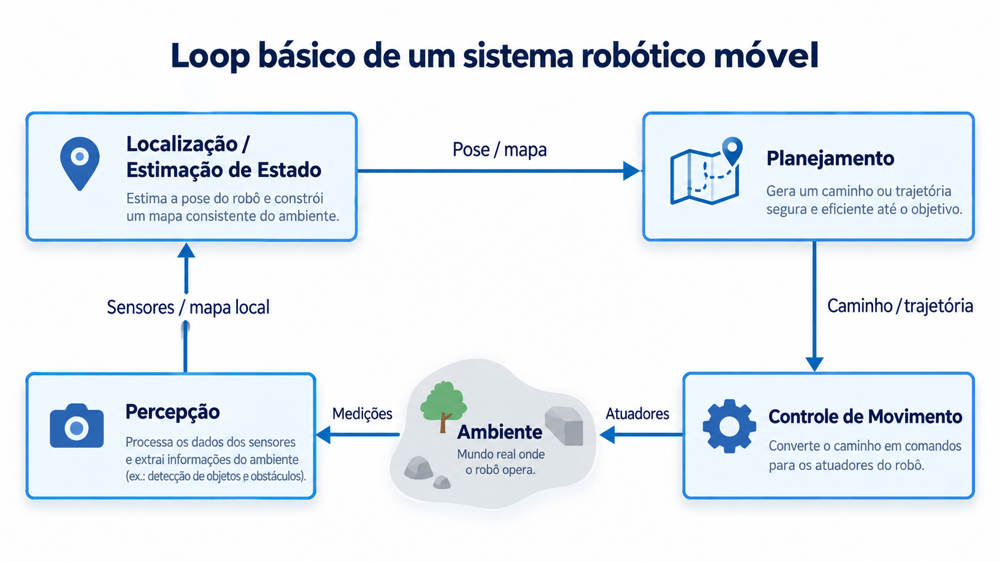

# Robótica Móvel

Projeto didático em Python para o estudo de robôs móveis com rodas utilizando Webots.

## Arquitetura geral

O projeto segue o loop básico de um sistema robótico móvel:



## Objetivos

Nesta etapa, o projeto aborda:

- modelagem cinemática de robôs móveis;
- odometria;
- controle proporcional;
- diferentes configurações de robôs com rodas;
- simulação no Webots.

## Estrutura

```text
src/robotica/
├── core/
├── robos/
├── estimacao/
└── controle/

webots/
├── worlds/
└── controllers/
```

## Tecnologias

- Python 3
- Webots
- Programação orientada a objetos
